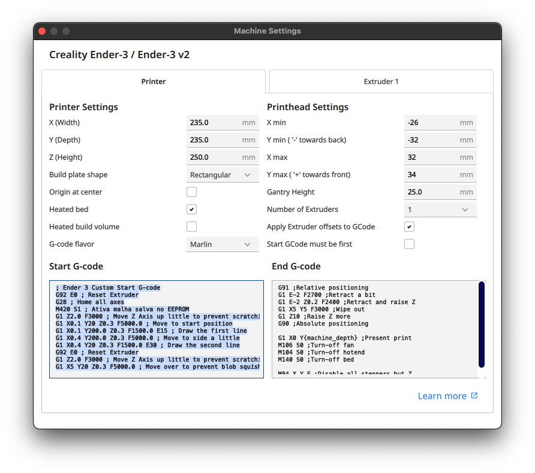

# Como configurar o Marlin 2.1.2.5 para Ender 3 v1 (placa Creality v4.2.7 + BLTouch)

⚠️ Este guia assume que você já instalou fisicamente o BLTouch corretamente e está familiarizado com o uso básico do Marlin e compilação de firmware via VSCode + PlatformIO.

## 📑 Índice

- [🎯 Hardware Alvo](#hardware-alvo)
- [📦 Firmware Pre-compilado](#firmware-pre-compilado)
- [🔧 Calibracao do Z-Offset e Nivelamento Automatico da Mesa (BLTouch)](#calibracao-do-z-offset-e-nivelamento-automatico-da-mesa-bltouch)
- [🧷 Ativar Nivelamento no Cura](#ativar-nivelamento-no-slicer)
- [🧰 Enviando Comandos via USB](#enviando-comandos-via-usb)
- [🧩 Como Compilar](#como-compilar)
- [⚙️ Modificacoes no Configuration.h](#modificacoes-no-configurationh)
- [📚 Referencia](#referencia)


### 🖨️ Hardware Alvo

- **Impressora**: Creality Ender 3 v1
- **Placa**: Creality V4.2.7 (STM32F103RE)
- **Sensor**: BLTouch
- **Firmware**: Marlin 2.1.2.5

## 📦 Firmware Pre-compilado

Se você não quiser compilar o firmware por conta própria, pode baixar o binário pré-compilado:

- **[Baixar firmware-Marlin-2.1.2.5-Ender3-v1-Creality-v4.2.7-BLTouch.bin](./firmware-Marlin-2.1.2.5-Ender3-v1-Creality-v4.2.7-BLTouch.bin)**

**Como instalar:**
1. Formate um cartão microSD como FAT32.
2. Copie o arquivo `.bin` para a raiz do cartão.
3. Desligue sua Ender 3.
4. Insira o cartão na impressora.
5. Ligue a impressora novamente.
6. Aguarde o processo de flash — a tela ficará em branco por alguns segundos e depois ligará normalmente.

Após o flash do firmware, [calibre o Z-offset e o nivelamento da mesa](#calibracao-do-z-offset-e-nivelamento-automatico-da-mesa-bltouch).

## 🔧 Calibracao do Z-Offset e Nivelamento Automatico da Mesa (BLTouch)

Após o flash do firmware, é importante calibrar o Z-offset e a malha de nivelamento da mesa. Siga os passos abaixo para configurar corretamente o BLTouch e garantir impressões niveladas:

1. **Inicialize a EEPROM e ajuste de origem da cama**  
   Envie os seguintes comandos:
   ```
   M502 ; Restaura os valores padrão do firmware
   M500 ; Salva os padrões na EEPROM
   M501 ; Recarrega a EEPROM
   ```
2. **Ajuste de origem para centralizar o bico na mesa**

   Caso o bico da extrusora não pare exatamente no centro da mesa após o comando de homing (`G28`), você pode fazer um ajuste de origem com os comandos abaixo:

   ```
   G1 X110 Y110 F6000   ; Move o bico até o centro teórico da mesa
   ```

   Coloque um objeto pequeno (como um ímã) no centro exato da mesa para servir como referência visual. Observe a posição do bico em relação ao objeto.

   Se o bico estiver deslocado, use o seguinte comando para compensar:

   ```
   M206 X-5 Y-16.5      ; Ajuste o deslocamento até o bico coincidir com o centro real
   ```

   Após cada ajuste, repita o comando `G1 X110 Y110 F6000` para verificar o novo posicionamento.

   Quando estiver satisfeito com a posição central, salve o ajuste na EEPROM com:

   ```
   M500                 ; Salva o valor de offset atual na EEPROM
   ```

3. **Faça homing com o BLTouch**
   ```
   M211 S0 ; Desativa os endstops de software temporariamente
   G28     ; Faz home
   ```

5. **Ajuste o eixo Z até o bico tocar suavemente a cama**
   ```
   G1 Z0    ; Move Z para 0
   G1 Z-0.1 ; Move Z para -0.1
   G1 Z-1.0 ; Move Z para -1.0
   ...
   ```
   Vá testando até encostar o bico na mesa.
   
   Quando encostar execute o comando abaixo com o valor encontrado para salvar o valor encontrado

   ```
   M851 Z-1.70 ; Substitua pelo valor encontrado
   M500       ; Salva o Z Offset no EEPROM
   M211 S1    ; Reativa os endstops de software
   ```

7. **Agora vamos usar o BLTouch para fazer o auto nivelamento da mesa:**
   ```
   G28  ; Fazer home novamente
   G29  ; Executar nivelamento automático da malha
   M500 ; Salvar malha na EEPROM
   ```

## 🧷 Ativar Nivelamento no Cura
Certifique-se de que o G-code inicial do seu slicer inclua:
```
G28
M420 S1
```



## 🧰 Enviando Comandos via USB

Para enviar comandos G-code como `G28` ou `G29`, você pode usar softwares gratuitos que se comunicam com sua impressora via cabo USB.

### Softwares Recomendados

- **Pronterface (Printrun)**  
  Download: [https://github.com/kliment/Printrun](https://github.com/kliment/Printrun)  
  Interface simples para enviar comandos e controlar a impressora manualmente.

- **OctoPrint**  
  Site: [https://octoprint.org](https://octoprint.org)  
  Interface web completa para controle remoto da impressora (requer Raspberry Pi ou computador).

- **Repetier-Host**  
  Site: [https://www.repetier.com/download-now/](https://www.repetier.com/download-now/)  
  Suporte para Windows/Linux/macOS com fácil conexão USB e console de comandos.

### Como Conectar via USB

1. Conecte sua Ender 3 ao computador via cabo USB (normalmente USB-B ou USB Mini-B).
2. Abra o software (ex: Pronterface).
3. Selecione a porta COM correta (geralmente detectada automaticamente).
4. Configure a taxa de transmissão para `115200`.
5. Clique em "Connect".
6. Uma vez conectado, você pode digitar comandos 

## 🧩 Como Compilar

1. **Baixe o Marlin 2.1.2.5**
   - Visite: [https://github.com/MarlinFirmware/Marlin/releases/tag/2.1.2.5](https://github.com/MarlinFirmware/Marlin/releases/tag/2.1.2.5)
   - Baixe o `Source code (zip)` e extraia.

2. **Copie os Arquivos de Configuração**
   - Clone ou baixe [este repositório](#como-configurar-o-marlin-212125-para-ender-3-v1-placa-creality-v427--bltouch).
   - Copie todos os arquivos (`Configuration.h`, `Configuration_adv.h`, `Version.h`, `_Bootscreen.h`, `_Statusscreen.h`) para a pasta `Marlin/` dentro da fonte extraída do Marlin.

3. **Abra o VSCode**
   - Abra a pasta raiz do Marlin no VSCode.
   - Instale a extensão [PlatformIO](https://platformio.org/platformio-ide) pela Marketplace do VSCode.
   - Instale a extensão [Auto Build Marlin](https://marketplace.visualstudio.com/items?itemName=MarlinFirmware.auto-build) pela Marketplace do VSCode.


4. **Compilar e Enviar**
   - Na barra lateral do VSCode, clique no ícone **Auto Build Marlin**.
   - Selecione:
     - **Environment**: `STM32F103RE_creality`
     - **Action**: Build ou Upload
   - Acompanhe o progresso e aguarde a confirmação.

5. **Flash do Firmware**
   - Após a compilação, o arquivo do firmware estará em:
     ```
     .pio/build/STM32F103RE_creality/firmware.bin
     ```
   - Copie o arquivo para a raiz de um **cartão microSD** (formatado como FAT32).
   - Desligue a impressora, insira o cartão e ligue novamente.
   - A impressora fará o flash automático do novo firmware e apagará o arquivo do cartão após concluir.


## ⚙️ Modificacoes no Configuration.h

Antes de compilar o firmware, edite os seguintes parâmetros no arquivo `Configuration.h`:

1. **Configure o `NOZZLE_TO_PROBE_OFFSET`**  
   Exemplo:
   ```cpp
   #define NOZZLE_TO_PROBE_OFFSET { -46, -5, 0 }
   ```
   A ponta do BLTouch está 46 mm à esquerda (eixo X negativo) e 5 mm à frente (eixo Y positivo) da ponta da extrusora. Deixe o terceiro valor como `0` — ele será ajustado manualmente depois.

   <p align="center">
      
   </p>
   <p align="center"><em>Figura: Distância entre o bico e o BLTouch</em></p>

2. **Defina o tamanho da mesa com margem de segurança**  
   Apesar da mesa ter 235mm, é recomendável configurar:
   ```cpp
   #define X_BED_SIZE 220
   #define Y_BED_SIZE 220
   ```

   > ℹ️ Isso evita colisões com as bordas e garante um espaço seguro para a sonda do BLTouch.

### 📚 Referencia

- Para ver a configuração oficial padrão para Ender 3 (Marlin 2.1.2.5), visite:  
  [Configuracao oficial Marlin Ender 3](https://github.com/MarlinFirmware/Configurations/tree/release-2.1.2.5/config/examples/Creality/Ender-3)

🔼 [Voltar ao topo](#como-configurar-o-marlin-212125-para-ender-3-v1-placa-creality-v427--bltouch)